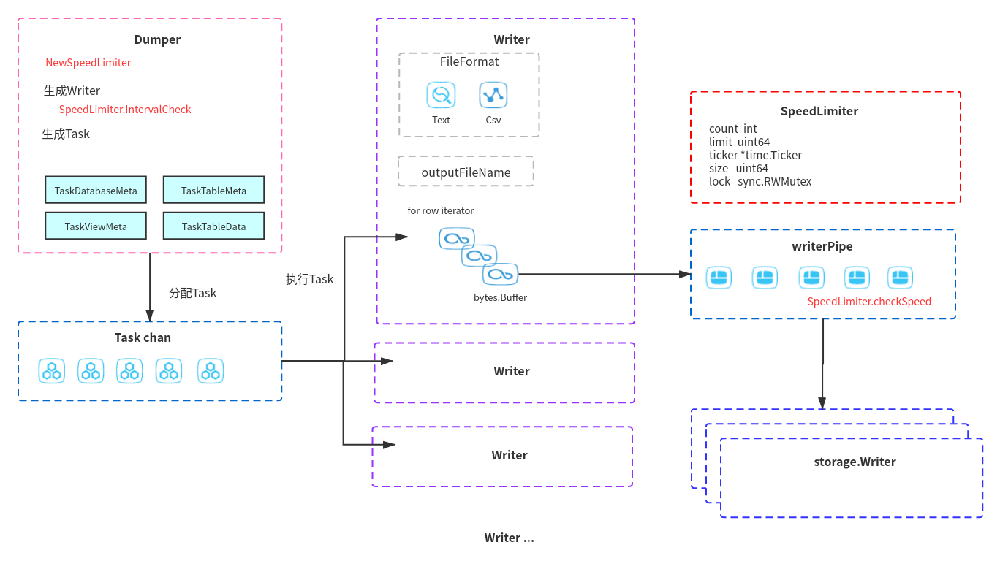

# dump历史数据限速设计、实现

> 由于公司网络环境原因，需要对历史数据dump进行限速。

## dumpling架构



### 数据一致性问题

### 拆分Task任务
Dumper 将需要dump的库表封装成Task，通过chan传递给Writer进行处理。

其中Task分为如下4类：

* TaskDatabaseMeta database元数据任务
* TaskTableMeta  表元数据任务
* TaskViewMeta  视图元数据任务
* TaskTableData  表数据任务，如果是大表，这边会根据表数据情况，拆分号

### 通过sql获取数据

Writer 通过投递sql获取数据

```go
func (td *tableData) Start(ctx context.Context, conn *sql.Conn) error {
	rows, err := conn.QueryContext(ctx, td.query)
    // ...
}
```

然后通过迭代器一点点获取数据

```go
for fileRowIter.HasNext() {
	lastBfSize := bf.Len()
	if selectedField != "" {
		if err = fileRowIter.Decode(row); err != nil {
			log.Error("scanning from sql.Row failed", zap.Error(err))
			return errors.Trace(err)
		}
		row.WriteToBuffer(bf, escapeBackSlash)
		} else {
			bf.WriteString("()")
		}
		counter++
		wp.AddFileSize(uint64(bf.Len()-lastBfSize) + 2) // 2 is for ",\n" and ";\n"
	// ...		
```

这边获取的数据，使用bytes.Buffer通过writerPipe，传递给storage.Writer进行最终的落盘。

使用池化的bytes.Buffer 进行数据传输，可以有效规避gc的问题。

## 限速实现方式

### 限速代码逻辑

我们的目标是，控制每秒dump数据量。可以简化为以一秒为时间单位，如果统计出，已经dump到我们设定的数据量，这一秒内剩余时间程序不再同步。

我们把1秒分为100份，每份10ms，如果数据dump已经到目标值，那剩下的时间份数就不再干活。

时间的实现，可以直接使用golang的time.Ticker

```go
t := time.NewTicker(time.Millisecond * 10)
```


### 限速代码集成

我们在新建Dumper的时候，直接新建SpeedLimiter。

在Dumper新建Writer 的时候，初始化时间计数

```go
func (d *Dumper) startWriters(ctx context.Context, wg *errgroup.Group, taskChan <-chan Task,
	rebuildConnFn func(*sql.Conn) (*sql.Conn, error)) ([]*Writer, func(), error) {
     // ...

	d.speedLimiter.IntervalCheck()
	for i := 0; i < conf.Threads; i++ {
        // ...
		writer := NewWriter(ctx, int64(i), conf, conn, d.extStore, d.speedLimiter)
        // ...
	}
	tearDown := func() {
		for _, w := range writers {
			w.conn.Close()
		}
		// cancel speed limiter interval check
	}
	return writers, tearDown, nil
}
```

我们在writerPipe统计文件大小时，进行速率统计确认

```go
func (b *writerPipe) AddFileSize(fileSize uint64) {
	b.currentFileSize += fileSize
	b.currentStatementSize += fileSize

	b.limiter.CheckSpeed(fileSize)
}
```


